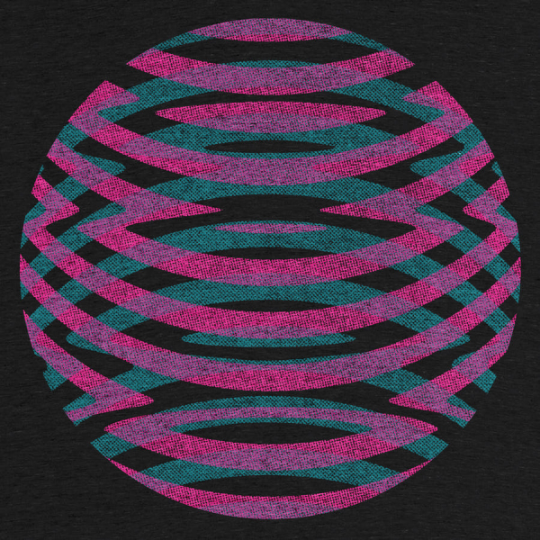

So, I had [grand plans](https://www.jamesstiff.com/2017/02/10/work-in-progress/) to unleash this T-shirt design last year but ended up flip-flopping between employment, freelance work and battling some demons…

Let’s just say that this particular project slipped down the list of priorities.

Having recently started a new, part-time contract at The University of Manchester (designing and developing healthcare apps), I was really keen to find something to keep me occupied during my off days without the pressures of client-focused work.

Finally getting this T-shirt out into the world seemed like a good place to start, so I tweaked the original design and submitted it to [Cotton Bureau](https://cottonbureau.com/products/hypersphere).

At the time of writing this post, the two-week campaign has hit 27 sales with just over 24 hours to go. If you're really quick, you can [buy your very own Hypersphere T-shirt here](https://cottonbureau.com/products/hypersphere).

The estimated $81 profit from Cotton Bureau sales won’t be sufficient to fund a run of UK-friendly T-shirts as hoped. Instead, I’ll be reinvesting the proceeds into a more affordable, limited edition of screenprints or Risograph prints.

If you like to receive updates when prints become available, please feel free to [subscribe to my newsletter ](https://www.jamesstiff.com/newsletter/)or follow me on [Twitter](https://twitter.com/jamesstiff) or [Instagram](https://instagram.com/jamesstiff).

\[Update: Monday, 9 April 2018\]

**Big thanks to everyone who supported the Cotton Bureau campaign!**

It reached a grand total of 30 sales and shirts should be winging their way to customers very soon.

**UK/EU edition now available via Mercht!**

For friends on this side of the Atlantic, I've not forgotten about you. Head over to Mercht where you can [get your very own UK/EU edition Hypersphere T-shirt ](https://www.mercht.com/c/hypersphere)for a limited time.